### Procedure
<b>Procedure in laboratory (diagram)</b> 

1)	Conical Fluxes (250 mL)
2)	Measuring Cylinder (25 mL)
3)	Volumetric Fluxes (100mL)
4)	Stopwatch
5)	Glass Rod 

<b>Procedure in laboratory (diagram)</b> 
 
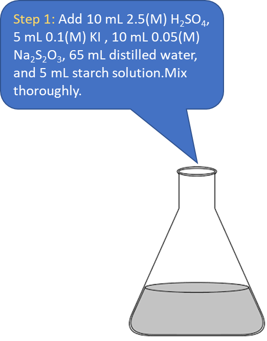
 
 
 
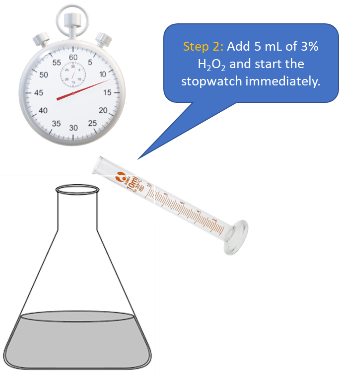
 
 
 
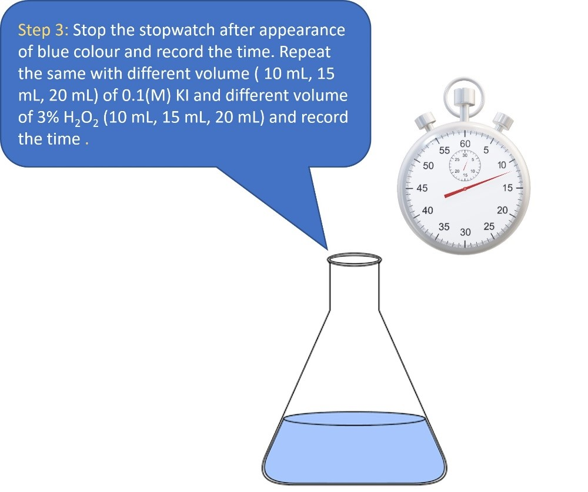 
 
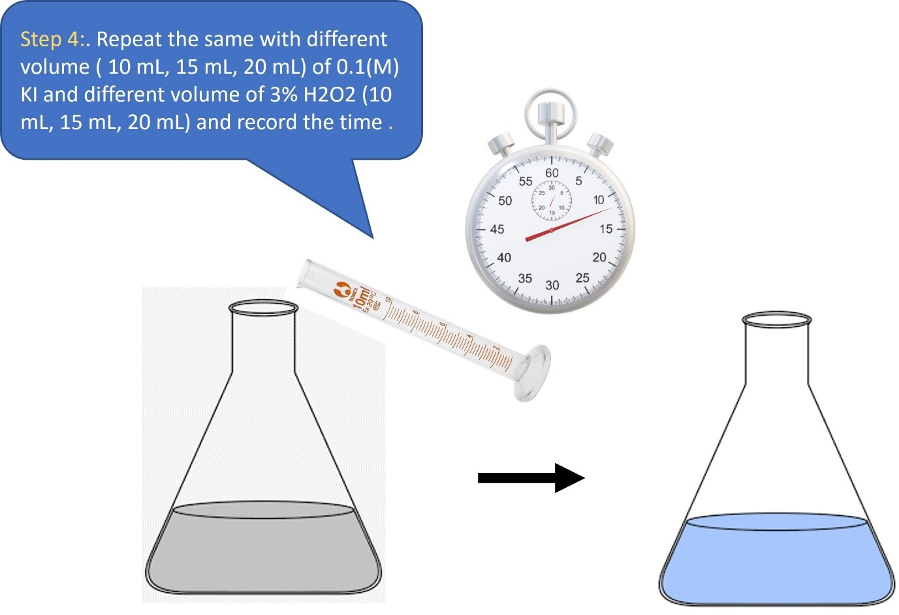 
 
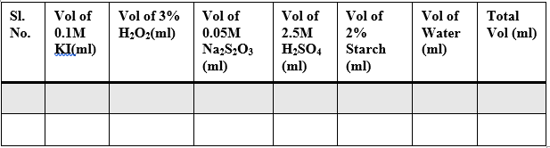 
 
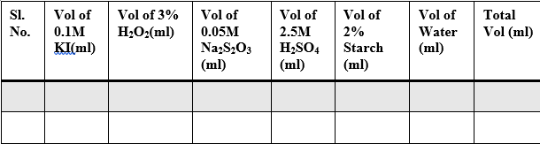 
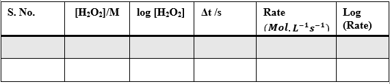 
 
 
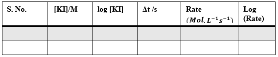 
 
 
 
 
 
<b>Procedure in laboratory</b> 
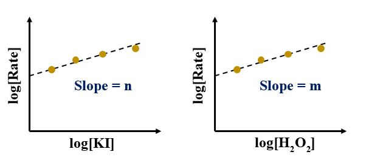See video! 
 
 
<b>Data and the analysis</b> 
<b>Table – 1</b>
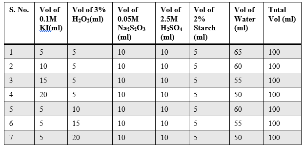 
 
 
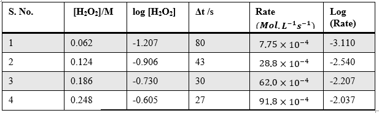 
<b>Table – 3</b> 
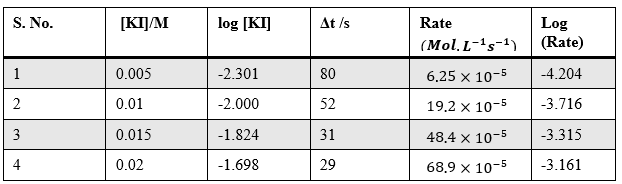 
 
 
<b>Procedure in simulator of the experiment</b> 
To be added based on the simulation 
<b>Simulator</b> 
To be created 
 
<b>Analysis</b> 
Plot of log[Rate] vs log[H2O2]: 
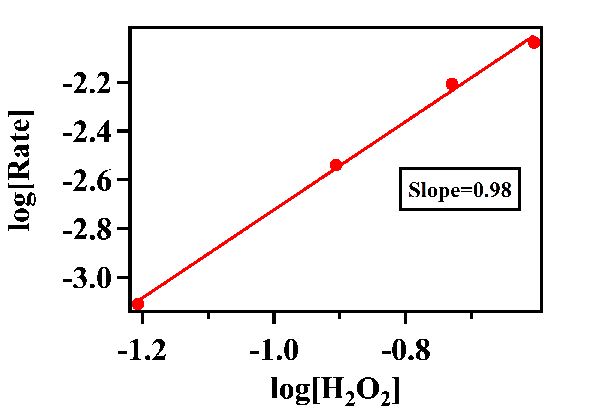 
Here, the order of the reaction with respect to H2O2 = 1 (nearest possible integer of 0.98) 
 
<b>Plot of log[Rate] vs log[KI]:</b> 
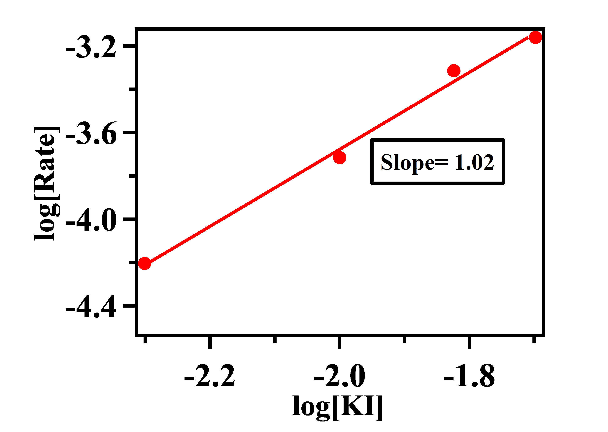 
Here the order of the reaction with respect to KI = 1 (nearest possible integer of 1.02) 
The rate law equation can be expressed as, 

Rate = k [I–] [H2O2]  , where ‘k’ is the rate constant. 

Now, Rate=-(∆[H_2 O_2])/∆t  ,        ∆[H_2 O_2]= 0.5× Moles of S2O32- consumed
                                                               = 0.5× 10 mL × 0.05 M × 0.001 mL-1
                                                               = 2.5 × 10-4 M  
          Rate=-(2.5 × 〖10〗^(-4)  M)/(80 s) = 3.125 × 10-6 M.s-1  

           Rate constant, k = Rate/([I^-] [H_2 O_2]) = (3.125 × 〖10〗^(-6)  M.s^(-1)  )/(0.062 M×0.005 M) = 0.01 M-1 s-1

